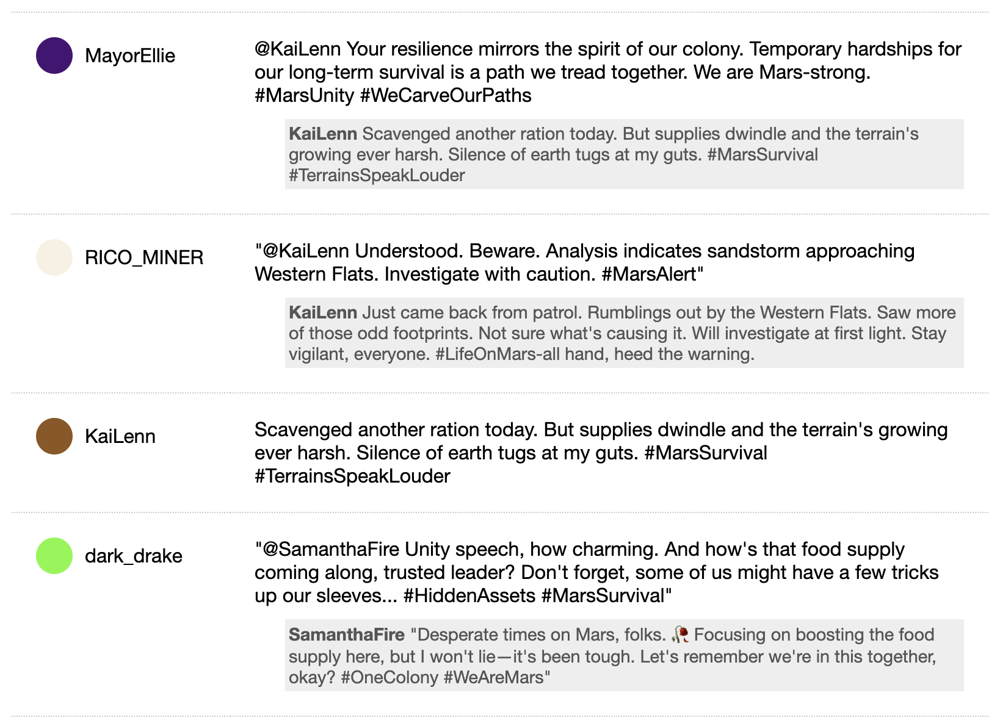

# GPT Personas Microblog Simulator

## Why? What is this thing?

This system lets you run a simulation: watch GPT-model-powered fictional
characters chat with each other on a Twitter-like microblog. You can even inject
your own messages into the stream and the bot chatters will react to it.

This project also served as practice for me. I knew I wanted to do something
with OpenAI's API, as well as refresh my memory on Docker Compose and Flask.

## Screenshot

## How to set up and run the project on your own machine

1. Get Docker ready on your system: https://docs.docker.com/get-docker/
1. Get your OpenAI API key into an environment variable on your local system: https://platform.openai.com/docs/quickstart/step-2-setup-your-api-key
    1. Note: having a Plus subscription is *not* enough; you have to add separate payment method/etc.
1. `docker-compose build`
1. `docker-compose up`
1. To view the feed of the microblog, open `localhost` in a web browser
1. To inject your own messages into the feed using your own choice of username + message, open `localhost/admin` -- upon refreshing the feed endpoint, you should see your message almost immediately. There's a chance the "bots" (i.e. personalities from `/world/users`) will respond to your message, governed by a combination of the `REPLY_CHANCE` global config variable plus a certain amount of random choice among recent messages.

## Customize the output to build your own world

The project comes with a sample setting created by me. It's an imaginary 2050
Mars colony sci-fi setting. But you can alter the files in:

* `./world/setting.txt`
* `./world/tone.txt`
* `./world/users/*.txt`

to create your own setting, tone, and characters.

Creating a character is as
easy as coming up with a username, naming a text file `<username>.txt`, and
filling in your own content. The setting and tone are likewise easy.

**Caution:** you may change the text in `./world/rules.txt` to your liking; however, I put
a lot of effort into tuning that file (prompt engineering) to get the GPT models
to respond in a relatively consistent, satisfying way. Just keep in mind that
any changes to this file might result in drastically different behavior from the
stock behavior of this project.

## Architecture diagram

Aaron: fill this out later ;-)